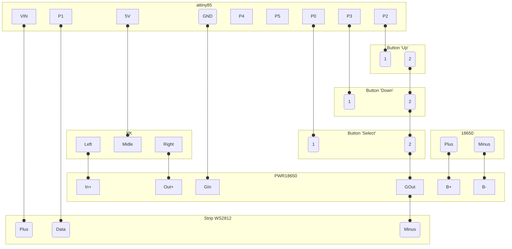

# munchkin-counter-attiny85

attiny85: 
https://aliexpress.ru/item/1005009295007260.html?spm=a2g2w.orderdetail.0.0.2e434aa6rKwOgn&sku_id=12000048647515666

контакты: 
https://aliexpress.ru/item/1005007462106934.html?spm=a2g2w.orderdetail.0.0.425c4aa67OsdVi&sku_id=12000040854137782

переключатель: 
https://aliexpress.ru/item/1005005536423156.html?spm=a2g2w.orderdetail.0.0.50e84aa68U7UC7&sku_id=12000033452360873

модуль зарядки 18650: 
https://aliexpress.ru/item/1005006629273407.html?spm=a2g2w.orderdetail.0.0.6dd24aa6vXEU91&sku_id=12000052880304971

## Схема включения элементов

## Подготовка

* установите arduino ide
* добавте http://drazzy.com/package_drazzy.com_index.json в Additional Boards Manager URLs
* установите платы AttinyCore 
* выберите плату AttinyCore - Attiny85(Micronucleus / Digispark)
* скомпилируйте скетч
* подключить\переподключить в usb-порт Attiny85

## Работа с устройством
### Установка 
Устройство загружается в режиме установки уровня первого игрока(все диоды светятся цветом первого игрока), 
`UP` для установки первого уровня (индикатор режима станет зеленоголубым). `Select` для перехода к редактированию уровня следущего игрока.
После устаноки первого уровня нужному числу играков (например четверым), нажмите `Select` до момента когда индикатор режима станет синим (до посинения),
нажмите `UP` для применения настроек (загорятся все диоды разными цветами), нажмите `Select` для переключения в режим отображения всех установленных играков.

### Игра
Устройство находится в режиме отображения всех играков (индикатор режима меняет цвет на цвет игрока раз 2 секунды). Нажмите `Select` для выбора игрока (индикатор режима зеленоголубой, уровни отображаются цветом игрока), кнопками `UP` и `DOWN` установите необходимый уровень,
кнопкой `Select` выберете режим отображения всех игроков (следующий за режимом функций, при котором индикатор режима горит синим).

### Функции
В режиме функий (индикатор режима горит синим, индикатор уровня не горит) нажатие `DOWN` приведет к влючению функции отображения случайного числа в диапазоне 1-10 на индекаторе уровня белым цветом, индикатор режима будет гореть так же белым. 